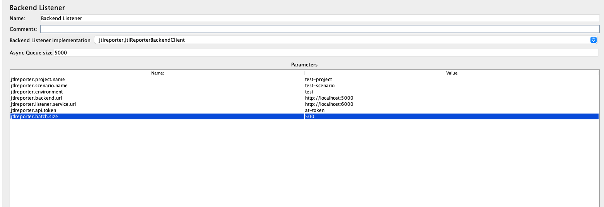

# JtlReporter JMeter Backend Listener
[JtlReporter](https://jtlreporter.site) Backend Listener for JMeter.
The plugin creates a new test run for a given project and scenario and steams the measurements
into [JtlReporter listener service](https://github.com/ludeknovy/jtl-reporter-listener-service) in batches.
After the test execution is finished it triggers the report processing. By using this plugin you can significantly
reduce the processing time in comparison with JTL/CSV file upload.



## Build plugin from source
```./gradle clean jar```

Copy generated jar file from [build/libs/](build/libs) into `$JMETER_HOME/lib/ext/`


## Setup
All the below-mentioned properties are required.
* `jtlreporter.project.name`, existing project name.
* `jtlreporter.scenario.name`, existing scenario name.
* `jtlreporter.environment`, test environment.
* `jtlreporter.backend.url`, JtlReporter Backend url.
* `jtlreporter.listener.service.url`, JtlReporter Listener Service url.
* `jtlreporter.api.token`, [API token](https://jtlreporter.site/docs/guides/administration/api-token).
* `jtlreporter.batch.size`, max value is 500.
